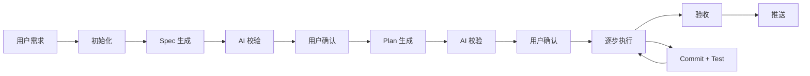

# Harness Skill — 自动化软件开发工作流

<p align="center">
  
  
  <a href="LICENSE"></a>
</p>

<p align="center">
  <b>中文</b> · <a href="README_EN.md">English</a>
</p>

---

## 概览

**Harness Skill** 是一个基于 [Claude Code](https://claude.ai/code) 的 skill 项目，将模糊的用户需求转化为**可追溯、可验证、可交付**的代码变更。

> 不止是 AI 生成代码，而是为软件开发提供一条完整且受控的工作流水线。



每一轮开发都留下清晰的轨迹：

| 轨迹 | 产物 | 说明 |
|------|------|------|
| 📋 | **Spec**（规格文档） | 需求是什么 |
| 🗺️ | **Plan**（执行计划） | 打算怎么做 |
| 📜 | **Commit History**（版本历史） | 实际怎么做的 |
| ✅ | **Test**（测试验证） | 结果对不对 |

## 快速安装

在项目目录下运行：

```bash
npx skills add https://github.com/tangjiahui-cn/harness-skill --skill spec-create-harness
```

安装完成后，在 Claude Code 中即可使用 `/spec-create-harness` 或相关触发词调用该 skill。

---

## 核心理念

| # | 原则 | 说明 |
|---|------|------|
| 1 | 🧠 **先理解，再动手** | 不在用户还没说完需求时就跳到代码实现 |
| 2 | 🔍 **AI 校验 + 人工确认** | Spec 和 Plan 都经过 AI 多轮审核和用户确认后才进入编码 |
| 3 | 🏷️ **每步可追溯** | 每一步执行都产生 git commit，支持回退到任意步骤 |
| 4 | 🧪 **测试驱动** | 每步完成后自动运行测试，失败则暂停报告 |
| 5 | 🔄 **中断恢复** | 工作流支持断点恢复，随时可以继续未完成的工作 |

---

## 工作流各步骤

1. **📝 需求输入** — 用户输入文本需求，AI 复述确认并澄清模糊点
2. **⚙️ 初始化** — 创建运行时目录和状态文件
3. **📄 Spec 生成** — 由子 Agent 生成规格文档，经 AI 多轮校验（最多 5 轮）和用户确认
4. **📋 Plan 生成** — 将开发过程拆解为可独立提交的步骤，同样经 AI 校验和用户确认
5. **🔨 执行与测试** — 按计划逐步实现，每步执行编译检查、lint、测试，通过后 git commit
6. **✅ 验收与推送** — 用户验收通过后归档，并询问是否推送到远程仓库

---

## 使用方式

在项目目录下运行 Claude Code，然后使用以下触发词调用工作流：

```
生成功能：我想给这个项目加一个用户登录功能，用 JWT token
开发功能：实现一个 REST API，支持文章的 CRUD
实现需求：添加一个数据导出功能，支持 CSV 格式
```

或者**直接输入你的需求文本**，AI 会自动识别并启动工作流。

### 实际示例

```
用户输入：我想给这个项目加一个用户登录功能，用 JWT token，
         不需要注册页面，直接用预设账号登录。

工作流响应：
 1. 复述需求并澄清
 2. 初始化：生成 name="登录功能"，shortId="aBcDeFgHiJ"，vId="登录功能_aBcDeFgHiJ"
 3. 生成 spec，AI 校验后由用户确认通过
 4. 生成 plan，AI 校验后由用户确认通过
 5. 逐个执行 plan 步骤，每步按 Conventional Commits 格式提交
 6. 执行完成后提示用户验收
 7. 验收通过后归档至 .harness/history/
 8. 询问是否推送到远程仓库
```

---

## License

[MIT](LICENSE)

---

<p align="center">
  Made with ❤️ for the Claude Code community
</p>
