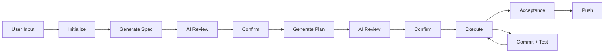

# Harness Skill — Automated Software Development Workflow

<p align="center">
  
  
  <a href="LICENSE"></a>
</p>

<p align="center">
  <a href="README.md">中文</a> · <b>English</b>
</p>

---

## Overview

**Harness Skill** is a [Claude Code](https://claude.ai/code) skill that transforms vague user requirements into **traceable, verifiable, and deliverable** code changes.

> More than AI-generated code — it's a fully controlled development pipeline.



Each development cycle leaves a clear trace:

| Artifact | Description |
|----------|-------------|
| 📋 **Spec** | What the requirement is |
| 🗺️ **Plan** | How to implement it |
| 📜 **Commit History** | What was actually done |
| ✅ **Test** | Whether the result is correct |

## Quick Installation

Run the following command in your project directory:

```bash
npx skills add https://github.com/tangjiahui-cn/harness-skill --skill spec-create-harness
```

After installation, you can invoke it in Claude Code via `/spec-create-harness` or its trigger phrases.

---

## Key Principles

| # | Principle | Description |
|---|-----------|-------------|
| 1 | 🧠 **Understand before coding** | Never jump to implementation before requirements are clear |
| 2 | 🔍 **AI review + human confirmation** | Specs and plans go through multi-round AI review and user confirmation before coding begins |
| 3 | 🏷️ **Fully traceable** | Every execution step produces a git commit; rollback to any step is supported |
| 4 | 🧪 **Test-driven** | Tests run automatically after each step; failures pause and report |
| 5 | 🔄 **Resumable** | Supports checkpoint recovery; unfinished work can be continued at any time |

---

## Workflow Steps

1. **📝 Input** — User describes the requirement; AI restates and clarifies ambiguities
2. **⚙️ Initialize** — Creates runtime directories and state files
3. **📄 Generate Spec** — A sub-agent generates the specification, followed by up to 5 rounds of AI review and user confirmation
4. **📋 Generate Plan** — The development process is broken into independently commit-able steps, also AI-reviewed and user-confirmed
5. **🔨 Execute & Test** — Steps are implemented one by one; each step runs compilation checks, linting, and tests before creating a git commit
6. **✅ Acceptance & Push** — User accepts the result; the work is archived and the user is asked whether to push to the remote

---

## Usage

Run Claude Code in your project directory and use trigger phrases like:

```
Add feature: I want to add a user login with JWT tokens
Implement: Create a REST API for article CRUD
Build: Add a CSV data export feature
```

Or simply **type your requirement naturally** — the AI will detect it and start the workflow automatically.

### Example

```
User input: I want to add a user login feature using JWT tokens,
            no registration page needed, just preset accounts.

Workflow response:
 1. Restate and clarify the requirement
 2. Initialize: name="login-feature", shortId="aBcDeFgHiJ", vId="login-feature_aBcDeFgHiJ"
 3. Generate spec → AI review → user confirms
 4. Generate plan → AI review → user confirms
 5. Execute plan steps one by one, each committed with Conventional Commits format
 6. Notify user for acceptance testing
 7. Archive to .harness/history/ on acceptance
 8. Ask whether to push to remote repository
```

---

## License

[MIT](LICENSE)

---

<p align="center">
  Made with ❤️ for the Claude Code community
</p>
